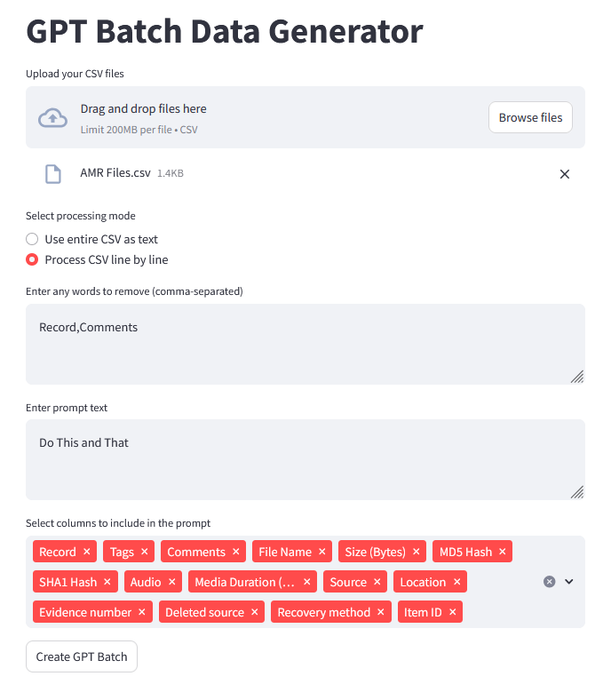

# GPT 배치 데이터 생성기

간단한 Streamlit 사용자 인터페이스를 사용하여 GPT 배치 데이터를 생성하는 스크립트.

## 설정

### 요구 사항

- **Python 3.10 이상**
- **OpenAI API 키**
- **Python 패키지**: 다음 명령어로 필요한 패키지를 설치

  ```bash
  pip install -r requirements.txt
  ```

### 구성

1. **OpenAI API 키 설정**

   - 프로젝트 디렉토리에 `.env` 파일을 생성
   - `.env` 파일에 OpenAI API 키를 추가

     ```
     OPENAI_API_KEY=your-openai-api-key
     ```

## 사용법

### Streamlit 앱 실행

다음 명령어를 실행하여 앱을 시작

```bash
streamlit run streamlit_gpt_ui.py
```

웹 브라우저에서 앱 실행



### 앱 사용 방법

1. **CSV 파일 업로드**

   - "Browse files" 버튼을 클릭하여 하나 이상의 CSV 파일을 업로드

2. **처리 모드 선택**

   - **전체 CSV를 텍스트로 사용**: 각 CSV 파일을 전체로 처리
   - **CSV를 한 줄씩 처리**: 각 행을 개별적으로 처리하며, 열 선택이 가능

3. **제거할 단어 입력**

   - 데이터에서 제거할 단어 또는 구문을 입력(쉼표로 구분).

4. **프롬프트 텍스트 입력**

   - 콘텐츠에 추가할 프롬프트 텍스트를 입력

5. **열 선택 (한 줄씩 처리하는 경우)**

   - 프롬프트에 포함할 열을 선택

6. **GPT 배치 생성**

   - "Create GPT Batch" 버튼을 클릭하여 처리를 시작
   - 배치가 생성되면 앱에서 알려줍니다.

7. **처리 대기**

   - 앱은 주기적으로 배치 상태를 확인 (10초 단위)
   - 배치 처리가 완료되면 메시지가 표시

8. **결과 다운로드**

   - 준비가 되면 "Download Results" 버튼이 활성화
   - 버튼을 클릭하여 결과를 다운로드
